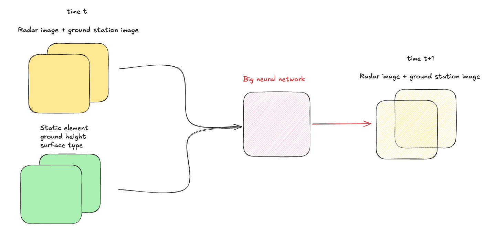

### A simple meteo model for France

This is the first iteration of a simple meteo model for France. 

### Big idea 

### The model

Here is a global overview of the architecture :

The key idea is to be able to forecast the weather in France with input only coming from the weather stations and radar stations.
The goal of this is to simply provide a weather forecast for the next few hours.
