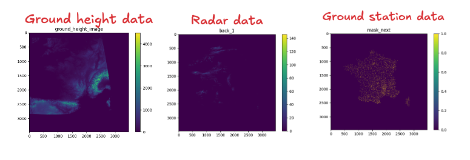

# MeteoLibre Model

## Table of Contents
1.  [Description](#description)
2.  [Introduction](#introduction)
3.  [Model Architecture](#model-architecture)
4.  [Data Sources](#data-sources)
5.  [Dataset and Preprocessing](#dataset-and-preprocessing)
6.  [Training and Evaluation](#training-and-evaluation)
7.  [Current Status](#current-status)
8.  [Roadmap](#roadmap)
9.  [Installation and Usage](#installation-and-usage)
10. [License](#license)
11. [Contributing](#contributing)
12. [Contact](#contact)

## Description

MeteoLibre Model is an open-source project dedicated to creating accessible and accurate weather forecasting models. Initially focused on France, the project aims to provide short-term weather predictions using data from weather and radar stations.

## Introduction

The MeteoLibre Model project is driven by the idea of democratizing weather forecasting. By leveraging open data sources and modern machine learning techniques, we aim to develop models that are both accurate and accessible to researchers, developers, and weather enthusiasts. Our primary goal is to forecast weather conditions in France using only weather and radar station inputs, offering a transparent and customizable alternative to proprietary weather services.

## Model Architecture

The project explores various model architectures to achieve optimal forecasting performance:

*   **UNET:** Used in early experiments, providing a baseline for image-based weather prediction.
*   **DiT (Diffusion Transformer):** A diffusion-based model that has shown promising results in generating high-quality weather forecasts.
*   **2D and 3D Transformers:** Explored for capturing spatial and temporal dependencies in weather data.


The architecture focuses on forecasting the evolution of radar images and incorporating ground station data to enrich the feature space.

## Data Sources

The model utilizes data from multiple sources:

*   **Weather Stations:** Provide ground-level weather measurements such as temperature, humidity, wind speed, and pressure.
*   **Radar Stations:** Offer real-time radar imagery, capturing precipitation patterns and intensity.
*   **Other Data Sources:** Includes topology data and ground type information from sources like IGN (Institut Géographique National).



These diverse data sources are crucial for creating a comprehensive and accurate weather model.

## Dataset and Preprocessing

The project has experimented with different datasets:

*   **Meteo France Radar Data:** Initial tests were conducted using radar data from Meteo France.
*   **UK Dataset:** A more structured dataset that has shown better learning results, particularly with the DiT architecture.

Preprocessing steps involve cleaning, normalizing, and transforming the data into suitable formats for model training.

## Training and Evaluation

The models are trained using scripts located in the `scripts/` directory. Key training scripts include:

*   `training_grid.py`: Initial training script for Meteo France radar data.
*   `training_grid_uk.py`: Training script for the UK dataset using UNET.
*   `training_grid_uk_dit.py`: Training script for the UK dataset using the DiT architecture.
*   `training_grid_uk_dit_local.py`: Training script for the UK dataset using the DiT architecture with local modifications.

Evaluation metrics include visual inspection of forecast accuracy and quantitative measures of image similarity.

## Current Status

*   Forecasting the evolution of radar images. **DONE**
*   Adding ground station input/output to enrich the feature space. **DONE**
*   Using DiT architecture for improved diffusion results on the UK dataset. **Achieved**
*   DiT architecture with local modifications to reduce compute complexity. **Implemented**

## Roadmap

*   Adding elevation information to improve forecasts. **TO BE DONE**
*   Adding ground clear sky irradiance. **TO BE DONE**
*   Extending prediction to whole Europe with new datasets. **TO BE DONE**

## Installation and Usage

1.  Clone the repository:

    ```bash
    git clone https://github.com/Forbu14/meteolibre_model.git
    cd meteolibre_model
    ```
2.  Install the required dependencies:

    ```bash
    pip install -r requirements.txt
    pip install -r requirements-dev.txt
    ```
3.  Download the necessary datasets (refer to `scripts/download_data.sh` for details).
4.  Run the training scripts:

    ```bash
    python scripts/training_grid_uk_dit.py
    ```

## License

This project is licensed under the Apache 2.0 License - see the [LICENSE](LICENSE) file for details.

## Contributing

We welcome contributions to the MeteoLibre Model project! Please refer to the [CONTRIBUTING.md](CONTRIBUTING.md) file for guidelines on how to contribute. Make sure to adhere to the coding standards and write appropriate tests.

## Contact

For questions or further information, please contact: [adrienbufort@gmail.com](mailto:adrienbufort@gmail.com) or visit our [GitHub repository](https://github.com/Forbu14/meteolibre_model/issues).
